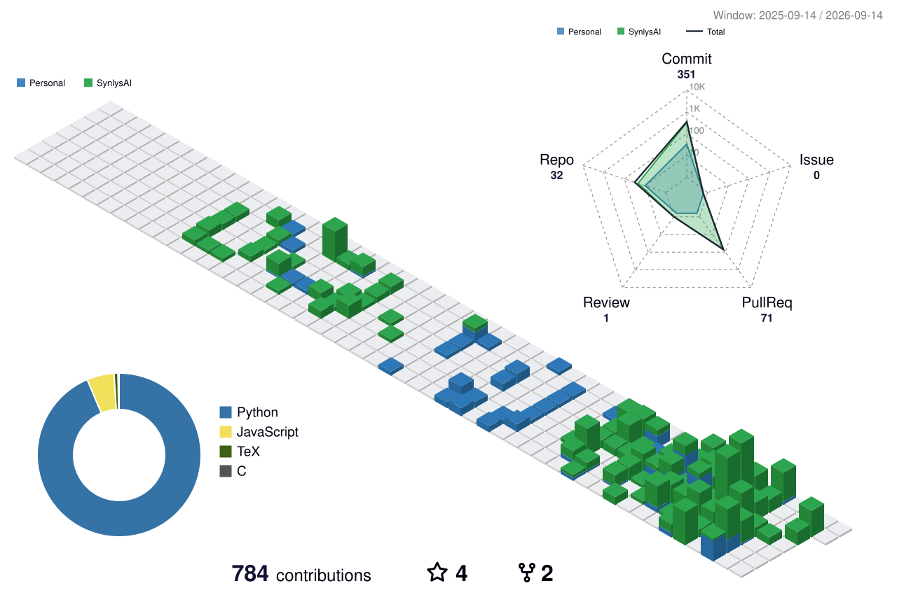



# FangYikaii

**AI4S researcher / full-stack FDE engineer**  
Scientific Agents · Research Systems · Optimization · Industrial AI

Core member of **SynlysAI**. I build reproducible AI4S systems and full-stack FDE workflows that connect models, experiments, and engineering constraints for scientific discovery and design. My background in mechatronics, systems engineering, automation, and industrial software shapes how I build and evaluate them.

  
  
  
  

  

  

<table>
  <tr>
    <td width="33%" valign="top"><b>AI4S Systems</b> Scientific agents, model evaluation, experiment workflows, and reproducible research tooling.</td>
    <td width="33%" valign="top"><b>FDE</b> Closed-loop design that connects domain constraints, optimization objectives, simulation, and decision support.</td>
    <td width="33%" valign="top"><b>Engineering Substrate</b> Mechatronics, automation, systems integration, industrial software, and full-stack implementation.</td>
  </tr>
</table>
